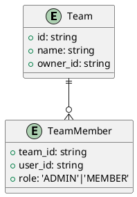

# 任务管理系统概要设计说明书

**文档标识：** SDD-001
**版本号：** 1.0
**编写日期：** 2025年9月13日
**编写人：** 裴雷
**审核人：** 裴雷
**批准人：** 裴雷

## 文档修订历史

| 版本 | 修订日期 | 修订内容 | 修订人 |
|------|----------|----------|--------|
| 1.0  | 2025-09-13 | 初始版本 | 裴雷 |

## 目录

1. [引言](#1-引言)
2. [系统总体设计](#2-系统总体设计)
3. [系统架构设计](#3-系统架构设计)
4. [功能模块设计](#4-功能模块设计)
5. [数据库设计概要](#5-数据库设计概要)
6. [接口设计概要](#6-接口设计概要)
7. [非功能性设计](#7-非功能性设计)
8. [技术选型](#8-技术选型)

---

## 1. 引言

### 1.1 编写目的

本文档的编写目的是：
- 从架构层面描述任务管理系统的整体设计方案
- 为详细设计提供架构指导和约束条件
- 为开发团队提供技术实现的总体框架
- 为项目管理提供技术评审的依据

### 1.2 项目背景

任务管理系统是一个面向小型团队的轻量级项目管理工具，旨在提供：
- 简洁直观的任务管理功能
- 基于时间管理理论的四象限任务分类
- 可视化的日历视图管理
- 多用户协作和权限管理

### 1.3 定义和缩略语

| 术语 | 定义 |
|------|------|
| SPA | Single Page Application，单页应用 |
| REST | Representational State Transfer，表述性状态转移 |
| JWT | JSON Web Token，JSON网络令牌 |
| ORM | Object-Relational Mapping，对象关系映射 |
| DTO | Data Transfer Object，数据传输对象 |

### 1.4 参考资料

- GB/T 11457-2006 信息技术 软件工程术语
- IEEE Std 1016-2009 软件设计描述标准
- 《软件架构设计》- 温昱等著

---

## 2. 系统总体设计

### 2.1 系统目标

#### 2.1.1 业务目标
- 提供直观易用的任务管理界面
- 支持基于四象限理论的科学任务分类
- 提供日历视图的时间管理功能
- 支持多用户协作和权限控制

#### 2.1.2 技术目标
- 采用前后端分离的现代化架构
- 确保系统的可扩展性和可维护性
- 提供RESTful API支持多端接入
- 保证系统的安全性和数据完整性

### 2.2 系统边界

#### 2.2.1 系统范围
**新增功能：**
- 团队创建与管理（含成员邀请/权限分级）
- 团队级任务分配与跟踪
- 团队工作空间隔离
**包含的功能：**
- 用户认证与权限管理
- 任务的增删改查操作
- 四象限任务分类与分析
- 日历视图与时间管理
- 基础的团队协作功能

**不包含的功能：**
- 复杂的项目管理功能
- 文件存储和管理
- 即时通讯功能
- 第三方系统集成

#### 2.2.2 用户类型
- **系统管理员**：具有所有权限，负责用户管理和系统配置
- **普通用户**：只能管理自己的任务和查看分配给自己的任务

### 2.3 系统约束

#### 2.3.1 技术约束
- 前端：React 18 + TypeScript
- 后端：NestJS + TypeScript
- 数据库：SQLite
- 部署：Docker容器化

#### 2.3.2 性能约束
- 系统响应时间 < 2秒
- 并发用户数 ≤ 100
- 数据库记录数 ≤ 100万条

#### 2.3.3 安全约束
- 所有API接口需要认证
- 敏感数据需要加密存储
- 需要防范常见的Web安全威胁

---

## 3. 系统架构设计

### 3.1 架构风格

采用**分层架构 + 前后端分离**的架构风格：

```
┌─────────────────────────────────────────────────────────────┐
│                    前端层 (Presentation Layer)              │
│  ┌─────────────────────────────────────────────────────────┐│
│  │              React SPA 应用                             ││
│  │  ┌─────────────┐ ┌─────────────┐ ┌─────────────────┐    ││
│  │  │  组件层     │ │  状态管理   │ │   路由与导航    │    ││
│  │  │ Components  │ │   Redux     │ │  React Router   │    ││
│  │  └─────────────┘ └─────────────┘ └─────────────────┘    ││
│  └─────────────────────────────────────────────────────────┘│
└─────────────────────────────────────────────────────────────┘
                              ↕ HTTP/HTTPS REST API
┌─────────────────────────────────────────────────────────────┐
│                    后端层 (Application Layer)               │
│  ┌─────────────────────────────────────────────────────────┐│
│  │                  NestJS 应用                            ││
│  │  ┌─────────────┐ ┌─────────────┐ ┌─────────────────┐    ││
│  │  │  控制器层   │ │  业务逻辑层 │ │   数据访问层    │    ││
│  │  │ Controllers │ │  Services   │ │   Repositories  │    ││
│  │  └─────────────┘ └─────────────┘ └─────────────────┘    ││
│  └─────────────────────────────────────────────────────────┘│
└─────────────────────────────────────────────────────────────┘
                              ↕ TypeORM
┌─────────────────────────────────────────────────────────────┐
│                   数据层 (Data Layer)                       │
│  ┌─────────────────────────────────────────────────────────┐│
│  │                  SQLite 数据库                          ││
│  │  ┌─────────────┐ ┌─────────────┐ ┌─────────────────┐    ││
│  │  │   用户表    │ │   任务表    │ │    其他业务表   │    ││
│  │  │   users     │ │   tasks     │ │   time_entries  │    ││
│  │  └─────────────┘ └─────────────┘ └─────────────────┘    ││
│  └─────────────────────────────────────────────────────────┘│
└─────────────────────────────────────────────────────────────┘
```

### 3.2 部署架构

```
┌─────────────────────────────────────────────────────────────┐
│                      Docker Host                            │
│                                                             │
│  ┌─────────────────┐  ┌─────────────────┐  ┌─────────────────┐│
│  │   Nginx 容器    │  │   应用容器      │  │   数据库容器    ││
│  │                 │  │                 │  │                 ││
│  │  ┌───────────┐  │  │  ┌───────────┐  │  │  ┌───────────┐  ││
│  │  │   静态    │  │  │  │  NestJS   │  │  │  │  SQLite   │  ││
│  │  │   文件    │  │  │  │    API    │  │  │  │  数据库   │  ││
│  │  │  服务     │  │  │  │   服务    │  │  │  │           │  ││
│  │  └───────────┘  │  │  └───────────┘  │  │  └───────────┘  ││
│  │                 │  │                 │  │                 ││
│  │   端口: 80      │  │   端口: 3000    │  │   内部端口      ││
│  └─────────────────┘  └─────────────────┘  └─────────────────┘│
│           │                     │                     │      │
│           └─────────────────────┼─────────────────────┘      │
│                                 │                            │
└─────────────────────────────────────────────────────────────┘
                                  │
                            ↕ 网络访问
                                  │
┌─────────────────────────────────────────────────────────────┐
│                        用户终端                             │
│              (浏览器 / 移动应用 / 第三方集成)               │
└─────────────────────────────────────────────────────────────┘
```

### 3.3 技术架构

#### 3.3.1 前端技术栈

### 组件层次结构
```
App
├── AuthProvider
├── MainLayout
│   ├── Navigation
│   └── ContentRouter
├── TaskDashboard
│   ├── QuadrantMatrix
│   └── CalendarView
└── AdminConsole
    ├── UserManager
    └── SystemMonitor
```
```
React 18
├── TypeScript (类型系统)
├── Redux Toolkit (状态管理)
├── React Router (路由管理)
├── Axios (HTTP客户端)
├── Material-UI (UI组件库)
├── Day.js (日期处理)
└── Chart.js (图表组件)
```

#### 3.3.2 后端技术栈
```
NestJS
├── TypeScript (开发语言)
├── TypeORM (ORM框架)
├── SQLite (数据库)
├── JWT (认证授权)
├── Class-validator (数据验证)
├── Swagger (API文档)
└── Jest (单元测试)
```

---

## 4. 功能模块设计

### 4.1 模块划分

新增团队协作模块：


系统按照业务功能划分为以下核心模块：

```
任务管理系统
├── 认证授权模块 (Auth Module)
├── 用户管理模块 (User Module)
├── 任务管理模块 (Task Module)
├── 日历管理模块 (Calendar Module)
├── 四象限分析模块 (Quadrant Module)
└── 系统管理模块 (System Module)
```

### 4.2 模块关系图

### 4.2.4 数据分析模块架构
**技术实现细节：**
```typescript
// 数据采集装饰器
@Injectable()
export class MetricsCollector {
  @Span('DATA_COLLECT')
  async collect(taskOpLog: TaskOperationLog) {
    // 写入消息队列
  }
}

// RxJS实时处理管道
const metrics$ = taskEvent$.pipe(
  windowTime(5000),
  mergeMap(events => from(events).pipe(
    groupBy(e => e.type),
    // 聚合计算逻辑
  ))
);
```
**数据处理流程：**
1. 数据采集：通过AOP拦截器收集业务操作日志
2. 实时计算：使用RxJS进行流式数据处理
3. 存储策略：
   - 热数据：Redis SortedSet
   - 温数据：SQLite表分区
   - 冷数据：JSON文件归档

**统计指标定义：**
```typescript
type DashboardMetrics = {
  completionRate: number; // 任务完成率
  avgCompletionTime: number; // 平均完成时长
  focusScore: number; // 专注度评分
  teamContribution: Record<string, number>; // 成员贡献度
};
```
```plantuml
component "数据采集服务" as collector
component "OLAP引擎" as olap
component "BI看板" as bi

collector --> olap : 原始数据
olap --> bi : 聚合指标
bi --> collector : 数据采样请求
```

```
┌─────────────────┐
│   前端路由模块   │
└─────────┬───────┘
          │
┌─────────▼───────┐    ┌─────────────────┐
│   认证授权模块   │◄──►│   用户管理模块   │
└─────────┬───────┘    └─────────────────┘
          │
┌─────────▼───────┐    ┌─────────────────┐
│   任务管理模块   │◄──►│   日历管理模块   │
└─────────┬───────┘    └─────────────────┘
          │
┌─────────▼───────┐    ┌─────────────────┐
│ 四象限分析模块   │    │   系统管理模块   │
└─────────────────┘    └─────────────────┘
```

### 4.3 核心模块设计

### 4.3.6 任务状态转换图
```plantuml
[*] --> Pending
Pending --> InProgress: 开始任务
Pending --> Canceled: 取消任务
InProgress --> Completed: 完成任务
InProgress --> Blocked: 任务受阻
Blocked --> InProgress: 解除阻碍
Completed --> Archived: 归档任务
```

#### 4.3.1 认证授权模块
**功能职责：**
- 用户登录认证
- JWT令牌管理
- 权限验证
- 会话管理

**主要接口：**
- `POST /auth/login` - 用户登录
- `POST /auth/logout` - 用户登出
- `POST /auth/refresh` - 刷新令牌
- `GET /auth/profile` - 获取用户信息

#### 4.3.2 用户管理模块
**功能职责：**
- 用户信息管理
- 角色权限管理
- 用户状态管理

**主要接口：**
- `GET /users` - 获取用户列表
- `POST /users` - 创建用户
- `PUT /users/:id` - 更新用户信息
- `DELETE /users/:id` - 删除用户

#### 4.3.3 任务管理模块
**功能职责：**
- 任务CRUD操作
- 任务状态管理
- 任务分配管理
- 四象限分类

**主要接口：**
- `GET /tasks` - 获取任务列表
- `POST /tasks` - 创建任务
- `PUT /tasks/:id` - 更新任务
- `DELETE /tasks/:id` - 删除任务
- `PATCH /tasks/:id/status` - 更新任务状态

#### 4.3.4 日历管理模块
**功能职责：**
- 日历视图数据
- 时间冲突检测
- 工作负载分析

**主要接口：**
- `GET /calendar` - 获取日历数据
- `GET /calendar/conflicts` - 冲突检测
- `GET /calendar/workload` - 工作负载分析

#### 4.3.5 四象限分析模块
**功能职责：**
- 任务象限计算
- 效率分析报告
- 优化建议生成

**主要接口：**
- `GET /quadrant/analysis` - 获取象限分析
- `GET /quadrant/suggestions` - 获取优化建议

---

## 5. 数据库详细设计

### 5.1 实体关系图（ER Diagram）
```plantuml
entity users {
  *id: integer
  username: varchar
  email: varchar
  password_hash: varchar
  role: varchar
  --
  PK(id)
  UK(username)
  UK(email)
}

entity tasks {
  *id: integer
  title: varchar
  description: text
  status: varchar
  --
  FK(creator_id) references users
  FK(assignee_id) references users
}

users ||--o{ tasks : creates
tasks }o--|| users : assigned_to
```

### 5.2 领域模型
```typescript
// 用户领域模型
class User {
  id: number;
  username: string;
  email: string;
  role: UserRole;
  tasks: Task[]; // 聚合根
}

// 任务值对象
class TaskDetails {
  title: string;
  description: string;
  priority: PriorityLevel;
  deadline: Date;
}

// 任务实体
class Task {
  id: number;
  details: TaskDetails;
  status: TaskStatus;
  assignee?: User;
}
```

### 5.1 数据库选型

**选择SQLite的原因：**
- 轻量级，无需独立数据库服务器
- 支持ACID事务，数据可靠性高
- 文件数据库，便于备份和迁移
- 适合中小型应用的数据规模

### 5.2 数据库架构

```
SQLite 数据库 (task_manager.db)
├── 用户相关表
│   ├── users (用户基本信息)
│   └── user_sessions (用户会话，可选)
├── 任务相关表
│   ├── tasks (任务主表)
│   ├── task_comments (任务评论)
│   └── time_entries (时间记录)
└── 系统相关表
    ├── system_config (系统配置)
    └── operation_logs (操作日志，可选)
```

### 5.3 核心实体关系

```
     users
       │
       │ 1:N (创建者)
       ▼
     tasks ◄──────┐
       │          │
       │ 1:N      │ N:1 (负责人)
       ▼          │
  task_comments   │
                  │
              time_entries
```

### 5.4 主要数据表

### teams表结构
```sql
CREATE TABLE teams (
  id TEXT PRIMARY KEY,
  name TEXT NOT NULL,
  description TEXT,
  created_at DATETIME DEFAULT CURRENT_TIMESTAMP
);

CREATE TABLE team_members (
  team_id TEXT REFERENCES teams(id),
  user_id TEXT REFERENCES users(id),
  role TEXT CHECK(role IN ('ADMIN', 'MEMBER')),
  PRIMARY KEY (team_id, user_id)
);
```

### 数据分析表结构
```typescript
interface TaskStatistic {
  date: string;
  completed: number;
  overdue: number;
  teamEfficiency: number;
}

// 历史数据归档策略
**归档任务调度：**
```plantuml
start
:每天凌晨2点触发;
:查询过期数据;
:执行压缩加密;
:上传对象存储;
:删除本地副本;
end
```

const archivePolicy = {
  retentionPeriod: 365, // 保留天数
  compression: 'gzip',
  encryption: 'aes-256-cbc',
  integrityCheck: true
};

interface HistoryArchive {
  snapshotId: string;
  archiveTime: Date;
  storagePath: string;
  checksum: string;
}
```

#### 5.4.1 用户表 (users)
```sql
CREATE TABLE users (
    id INTEGER PRIMARY KEY AUTOINCREMENT,
    username VARCHAR(50) UNIQUE NOT NULL,
    email VARCHAR(100) UNIQUE NOT NULL,
    password_hash VARCHAR(255) NOT NULL,
    role VARCHAR(20) DEFAULT 'user',
    status VARCHAR(20) DEFAULT 'active',
    display_name VARCHAR(100),
    avatar VARCHAR(500),
    created_at DATETIME DEFAULT CURRENT_TIMESTAMP,
    updated_at DATETIME DEFAULT CURRENT_TIMESTAMP
);
```

#### 5.4.2 任务表 (tasks)
```sql
CREATE TABLE tasks (
    id INTEGER PRIMARY KEY AUTOINCREMENT,
    title VARCHAR(200) NOT NULL,
    description TEXT,
    status VARCHAR(20) DEFAULT 'pending',
    priority VARCHAR(10) DEFAULT 'medium',
    importance VARCHAR(10) DEFAULT 'low',
    urgency VARCHAR(10) DEFAULT 'low',
    quadrant INTEGER,
    estimated_hours DECIMAL(5,2),
    actual_hours DECIMAL(5,2),
    start_date DATE,
    deadline DATE,
    is_all_day BOOLEAN DEFAULT true,
    assignee_id INTEGER,
    creator_id INTEGER NOT NULL,
    created_at DATETIME DEFAULT CURRENT_TIMESTAMP,
    updated_at DATETIME DEFAULT CURRENT_TIMESTAMP,
    FOREIGN KEY (assignee_id) REFERENCES users(id),
    FOREIGN KEY (creator_id) REFERENCES users(id)
);
```

---

## 6. 接口详细设计

### 6.1 任务接口序列图
```plantuml
participant Frontend as 前端
participant Controller as 任务控制器
participant Service as 任务服务
participant Repository as 仓储层
participant Database as 数据库

前端 -> Controller: POST /tasks
Controller -> Service: createTask(dto)
Service -> Repository: save(taskEntity)
Repository -> Database: INSERT INTO tasks
Database --> Repository: 新任务ID
Repository --> Service: Task实体
Service --> Controller: TaskResponse DTO
Controller --> 前端: 201 Created
```

### 6.2 接口参数验证
```typescript
// 任务创建DTO
class CreateTaskDto {
  @IsString()
  @Length(5, 200)
  title: string;

  @IsEnum(Priority)
  priority: Priority;

  @IsDate()
  @MinDate(new Date())
  deadline: Date;
}

// 使用class-validator进行参数校验
@Post()
async create(@Body() createTaskDto: CreateTaskDto) {
  return this.taskService.create(createTaskDto);
}
```

### 6.1 接口设计原则

- **RESTful风格**：遵循REST架构原则
- **统一响应格式**：所有接口返回统一的JSON格式
- **版本控制**：URL中包含版本号 `/api/v1/`
- **状态码规范**：使用标准HTTP状态码
- **安全性**：所有接口需要身份验证

### 6.2 接口分类

#### 6.2.1 认证接口
```
POST /api/v1/auth/login      # 用户登录
POST /api/v1/auth/logout     # 用户登出
POST /api/v1/auth/refresh    # 刷新令牌
```

#### 6.2.2 用户管理接口
```
GET    /api/v1/users         # 获取用户列表
POST   /api/v1/users         # 创建用户
GET    /api/v1/users/:id     # 获取用户详情
PUT    /api/v1/users/:id     # 更新用户信息
DELETE /api/v1/users/:id     # 删除用户
```

#### 6.2.3 任务管理接口

### 看板数据接口
**时序图：**
```plantuml
actor User as 用户
participant DashboardUI as 看板界面
participant AnalysisService as 分析服务
participant Cache as 缓存层

用户 -> 看板界面: 选择时间范围
看板界面 -> 分析服务: 携带JWT令牌请求
分析服务 -> 缓存层: 检查缓存命中
alt 命中缓存
  缓存层 --> 分析服务: 返回预计算数据
else 未命中
  分析服务 -> 分析服务: 执行实时计算
  分析服务 -> 缓存层: 写入缓存
end
分析服务 --> 看板界面: 返回指标数据
看板界面 -> 用户: 渲染可视化图表
```
```typescript
// 获取看板聚合数据
@Get('/dashboard')
async getDashboardData(
  @Query('teamId') teamId: string,
  @Query('timeRange') timeRange: DateRange
): Promise<DashboardResponse> {
  // 实现逻辑
}

// 日历视图数据结构
type CalendarView = {
  date: string;
  tasks: Task[];
  tags: string[];
};
```
```
GET    /api/v1/tasks         # 获取任务列表
POST   /api/v1/tasks         # 创建任务
GET    /api/v1/tasks/:id     # 获取任务详情
PUT    /api/v1/tasks/:id     # 更新任务
DELETE /api/v1/tasks/:id     # 删除任务
PATCH  /api/v1/tasks/:id/status  # 更新任务状态
```

#### 6.2.4 日历接口
```
GET /api/v1/calendar         # 获取日历数据
GET /api/v1/calendar/conflicts   # 冲突检测
GET /api/v1/calendar/workload    # 工作负载分析
```

#### 6.2.5 四象限接口
```
GET /api/v1/quadrant/analysis      # 象限分析
GET /api/v1/quadrant/suggestions   # 优化建议
```

### 6.3 统一响应格式

```typescript
interface ApiResponse<T> {
  success: boolean;
  data?: T;
  message?: string;
  error?: {
    code: string;
    message: string;
    details?: any;
  };
  meta?: {
    timestamp: string;
    requestId: string;
    pagination?: PaginationInfo;
  };
}
```

---

## 7. 非功能性设计

### 7.1 性能设计

#### 7.1.1 响应时间要求
- API接口响应时间 < 500ms
- 页面加载时间 < 2s
- 数据库查询时间 < 100ms

#### 7.1.2 并发性能
- 支持并发用户数：100
- 数据库连接池：10-20
- 内存使用限制：< 512MB

#### 7.1.3 性能优化策略
- 数据库索引优化
- 前端组件懒加载
- API响应数据缓存
- 静态资源CDN加速

### 7.2 可靠性设计

#### 7.2.1 故障处理
- 数据库连接失败重试机制
- API调用超时处理
- 前端错误边界处理
- 用户操作失败友好提示

#### 7.2.2 数据备份
- 定期数据库备份
- 用户数据导出功能
- 系统配置备份

### 7.3 安全性设计

### 安全审计流程
```plantuml
start
:每月第一周启动审计;
:检查JWT密钥轮换记录;
:验证数据库加密状态;
:扫描接口访问日志;
:生成安全报告;
end
```

#### 7.3.1 认证安全
- JWT令牌认证
- 密码哈希存储
- 会话超时管理
- 防暴力破解机制

#### 7.3.2 数据安全
- SQL注入防护
- XSS攻击防护
- CSRF攻击防护
- 敏感数据加密

#### 7.3.3 API安全
- 接口访问频率限制
- 参数验证和过滤
- 错误信息脱敏
- HTTPS传输加密

### 7.4 可维护性设计

### 单元测试覆盖率要求
| 模块类型 | 行覆盖率 | 分支覆盖率 |
|----------|---------|----------|
| 业务逻辑 | ≥85% | ≥75% |
| 工具类 | ≥95% | ≥90% |
| API接口 | ≥80% | ≥70% |

### 测试用例示例
```typescript
describe('TaskService', () => {
  it('should create task with valid data', async () => {
    const task = await service.create(validTaskDto);
    expect(task).toHaveProperty('id');
    expect(task.status).toBe('PENDING');
  });
});
```

#### 7.4.1 代码规范
- TypeScript类型约束
- ESLint代码检查
- 统一的代码格式化
- 完善的注释文档

#### 7.4.2 模块化设计
- 高内聚低耦合
- 清晰的模块边界
- 标准的接口定义
- 可插拔的组件设计

### 7.5 可扩展性设计

#### 7.5.1 水平扩展
- 无状态应用设计
- 数据库读写分离预留
- 缓存系统预留接口
- 负载均衡支持

#### 7.5.2 功能扩展
- 插件化架构预留
- 开放API接口
- 主题系统支持
- 多语言国际化预留

---

## 8. 技术选型

### 8.1 技术选型原则

- **成熟稳定**：选择经过验证的技术栈
- **社区活跃**：有良好的社区支持和文档
- **学习成本**：团队容易掌握和维护
- **未来发展**：技术有良好的发展前景

### 8.2 前端技术选型

| 技术领域 | 选型 | 版本 | 选择理由 |
|----------|------|------|----------|
| 核心框架 | React | 18.x | 生态丰富，组件化开发，性能优秀 |
| 开发语言 | TypeScript | 5.x | 类型安全，开发效率高，维护性好 |
| 状态管理 | Redux Toolkit | 1.9.x | 状态管理标准方案，调试工具完善 |
| 路由管理 | React Router | 6.x | React官方推荐，功能完善 |
| UI组件库 | Material-UI | 5.x | 组件丰富，设计规范，可定制性强 |
| HTTP客户端 | Axios | 1.x | 功能完善，拦截器支持，错误处理 |
| 构建工具 | Vite | 4.x | 构建速度快，开发体验好 |

### 8.3 后端技术选型

| 技术领域 | 选型 | 版本 | 选择理由 |
|----------|------|------|----------|
| 核心框架 | NestJS | 10.x | 企业级框架，装饰器语法，模块化设计 |
| 开发语言 | TypeScript | 5.x | 类型安全，与前端技术栈统一 |
| ORM框架 | TypeORM | 0.3.x | TypeScript原生支持，功能完善 |
| 数据库 | SQLite | 3.x | 轻量级，无需独立服务器，适合MVP |
| 认证授权 | JWT | - | 无状态认证，前后端分离友好 |
| API文档 | Swagger | 7.x | 自动生成文档，调试界面友好 |
| 数据验证 | class-validator | 0.14.x | 装饰器语法，与NestJS集成良好 |
| 测试框架 | Jest | 29.x | NestJS默认测试框架，功能完善 |

### 8.4 部署技术选型

| 技术领域 | 选型 | 版本 | 选择理由 |
|----------|------|------|----------|
| 容器化 | Docker | 24.x | 标准化部署，环境一致性 |
| 容器编排 | Docker Compose | 2.x | 简单易用，适合单机部署 |
| Web服务器 | Nginx | 1.25.x | 高性能，静态资源服务，反向代理 |
| 进程管理 | PM2 | 5.x | Node.js进程管理，日志管理 |

### 8.5 开发工具选型

| 工具类型 | 选型 | 用途 |
|----------|------|------|
| 代码编辑器 | VS Code | 开发IDE |
| 版本控制 | Git | 代码版本管理 |
| 包管理器 | npm/yarn | 依赖包管理 |
| 代码规范 | ESLint + Prettier | 代码检查和格式化 |
| API测试 | Postman/Insomnia | 接口调试 |
| 数据库管理 | DB Browser for SQLite | 数据库查看和管理 |

---

## 9. 风险评估

### 9.1 技术风险

| 风险项 | 风险等级 | 影响 | 应对措施 |
|--------|----------|------|----------|
| SQLite性能瓶颈 | 中 | 大数据量时性能下降 | 数据分页、索引优化、预留数据库迁移方案 |
| 前端状态管理复杂 | 低 | 开发效率影响 | 使用Redux Toolkit简化状态管理 |
| TypeScript学习成本 | 低 | 开发进度影响 | 渐进式采用，提供培训支持 |

### 9.2 业务风险

| 风险项 | 风险等级 | 影响 | 应对措施 |
|--------|----------|------|----------|
| 需求变更频繁 | 中 | 开发计划调整 | 模块化设计，预留扩展接口 |
| 用户体验不佳 | 中 | 产品接受度 | 用户测试，迭代优化 |
| 竞品功能领先 | 低 | 市场竞争力 | 聚焦核心功能，差异化定位 |

---

## 10. 附录

### 10.1 参考文档

- NestJS官方文档：https://docs.nestjs.com/
- React官方文档：https://react.dev/
- TypeORM文档：https://typeorm.io/
- Material-UI文档：https://mui.com/

### 10.2 术语表

| 术语 | 英文 | 定义 |
|------|------|------|
| 四象限 | Eisenhower Matrix | 基于重要性和紧急性的任务分类方法 |
| 工作负载 | Workload | 在特定时间段内分配给用户的任务量 |
| 时间冲突 | Time Conflict | 同一时间段内安排了多个任务的情况 |

---

**文档状态：** 草稿 → 评审 → 批准
**当前状态：** 草稿
**下一步：** 技术评审

*本文档为任务管理系统的概要设计说明书，定义了系统的总体架构和技术方案。*